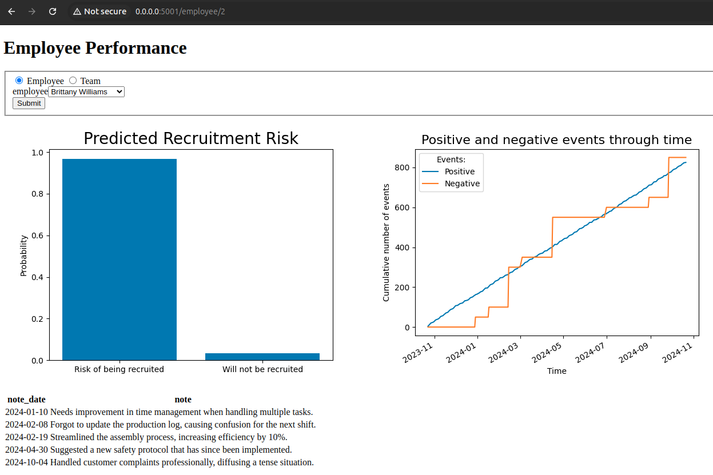
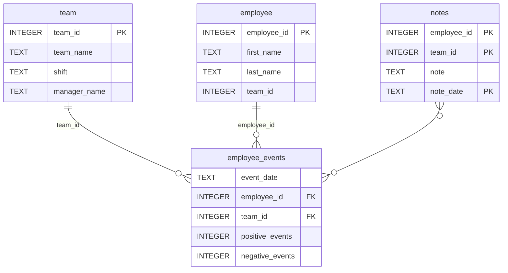

# Software Engineering for Data Scientists 

# Data Science Dashboard

As a data scientist at a manufacturing company, you are tasked with addressing management's concern about losing top employees to competitors. The data team has implemented a system where managers record employees' performance events in a database (employee_events). A machine learning model has been developed to predict the likelihood of employees being recruited. Your responsibility is to build a dashboard that:

1. Monitors employee performance (individual or team).
2. Displays the predicted likelihood of recruitment for an individual or team (average risk).

### Installation Instructions

Install Ubuntu:<br/>
https://ubuntu.com/

Install Conda:<br/>
https://docs.conda.io/projects/conda/en/latest/user-guide/install/index.html

Create a Conda environment with the following command:

```
conda install -n SE4DS python=3.10
conda activate SE4DS
```

Install all the required Python libraries:

```
python -m pip install -r requirements.txt 
```

Install our Python package `employee_events`:


```
python -m pip install python-package/
```

Run the tests:

```
pytest tests/test_employee_events.py 
```

Execute the server for the web application:

```
python report/dashboard.py
```

If done correctly, you should be able to visit this local website: http://0.0.0.0:5001



### Repository Structure
```
├── README.md
├── assets
│   ├── model.pkl
│   └── report.css
├── env
├── python-package
│   ├── employee_events
│   │   ├── __init__.py
│   │   ├── employee.py
│   │   ├── employee_events.db
│   │   ├── query_base.py
│   │   ├── sql_execution.py
│   │   └── team.py
│   ├── requirements.txt
│   ├── setup.py
├── report
│   ├── base_components
│   │   ├── __init__.py
│   │   ├── base_component.py
│   │   ├── data_table.py
│   │   ├── dropdown.py
│   │   ├── matplotlib_viz.py
│   │   └── radio.py
│   ├── combined_components
│   │   ├── __init__.py
│   │   ├── combined_component.py
│   │   └── form_group.py
│   ├── dashboard.py
│   └── utils.py
├── requirements.txt
├── start
├── tests
    └── test_employee_events.py
```

### employee_events.db


